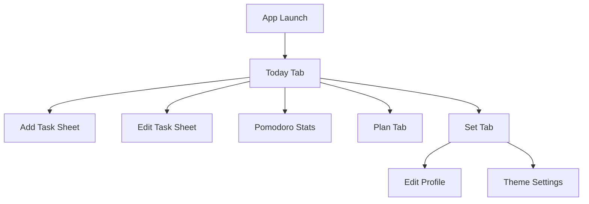

# iOS Todo App 简洁版技术方案

## 1. 文档信息

- 项目名称：`JellyTodo`
- 文档名称：iOS Todo App 简洁版技术方案
- 适用平台：iOS 16+
- 目标版本：MVP 1.0
- 产品定位：超轻量本地 Todo 应用，强调纯白灰黑、超大字号、大卡片、果冻感拟态；未来通过订阅解锁数据上云
- 核心目标：快速上线，优先保证 Today 页体验、极低学习成本、流畅稳定

### 1.1 文档治理规则

- 本文档是 `JellyTodo` 的唯一产品与技术真相源
- 后续若调整功能范围、页面结构、数据模型、主题规则、交互规则，必须先更新本文档，再修改代码
- 涉及本地数据库、云同步、云测数据、部署环境的改动，必须同步更新 `data_management_and_cloud_sync_plan.md`
- 仅影响内部实现细节、且不改变外部行为时，可只修改代码
- 每次里程碑交付前，需检查本文档与当前实现是否一致

## 2. 本次补充后的产品范围

### 2.1 一级信息架构

底部 Tab 固定为 3 个：

| Tab | 名称 | 说明 |
| --- | --- | --- |
| Plan | 计划 | 展示可折叠任务组，任务组下可继续增加 item |
| Today | 今日待办 | 默认首页，展示今日任务和新增入口 |
| Set | 设置 | 展示个人账户设置、主题设置、应用偏好等 |

### 2.2 新增二级页面

- Today 页右上角新增一个小型饼状图 icon
- 点击后进入二级页：`Pomodoro Stats`
- 页面职责：展示 3D 立体饼图、竖状占比图、总专注时长、专注计划数、完成番茄数量、目标完成率等

### 2.3 MVP 功能范围

- Todo 任务新增、编辑、删除、完成切换
- Plan / Today / Set 三个一级页面
- Today 页顶部番茄钟统计入口
- Today 全完成后触发居中打卡引导；用户进入打卡页并点击完成打卡后，才创建当天打卡记录和日历 icon
- 完整番茄钟计时能力，时长来自任务自身的 `Daily Duration`，不再使用固定 Focus / Short Break / Long Break 时长配置
- 任务周期闭环：Plan item 作为长期模板，Today task 作为某一天的执行实例；周期规则自动生成当天实例
- 本地任务持久化
- 本地设置持久化
- 本地番茄钟统计持久化

### 2.4 非 MVP 范围

- 正式生产账号登录/注册
- 正式生产云同步
- 正式订阅购买和 App Store Server API 级订阅状态校验
- 生产级多端同步
- 任务标签、优先级、复杂筛选
- 深色模式大改版
- 社交、协作、分享

说明：
说明：
`Set` 页中的“个人账户设置”在当前阶段仍以本地个人资料和开发期账号联调为主；Apple 登录一期代码已接入，但免费开发者账号阶段默认不启用 Sign in with Apple entitlement，生产级账号、订阅验签和多设备同步仍未完成。

### 2.5 订阅能力边界

后续商业化按 `Free / Pro` 两档设计：

| 版本 | 数据位置 | 卸载后数据 | 云备份/恢复 | 多设备同步 |
| --- | --- | --- | --- | --- |
| Free | 仅本机 SQLite | 丢失 | 不支持 | 不支持 |
| Pro | 本机 SQLite + 云端同步 | 可登录恢复 | 支持 | 支持 |

规则：

- Free 仍支持完整本地核心功能，包括 Plan、Today、番茄钟、统计和本地设置。
- Free 数据会持久化在 App 沙盒内，正常退出和重启不丢失；卸载 App 后由 iOS 删除沙盒，因此数据丢失。
- Pro 开启云备份、云恢复和多设备同步。
- Pro 同步必须基于本地优先架构：所有操作先写入本地 SQLite，再根据订阅状态决定是否写入 change_logs 并同步。
- 订阅状态校验、Apple IAP、Receipt / StoreKit 2 验证不进入当前 MVP。
- 未订阅用户不得把个人数据上传云端，除非用户主动升级并明确开启云同步。

## 3. 设计原则

### 3.1 视觉基调

- 背景纯白：`#FFFFFF`
- 卡片浅灰：`#F5F5F7`
- 主文字深灰：`#333333`
- 辅助文字浅灰：`#888888`
- 全局禁用彩色强调
- 仅使用黑白透明阴影和高光制造果冻感

### 3.2 版式原则

- 大标题、大卡片、大留白
- 页面结构尽量少层级
- 单屏信息密度低，优先“看起来舒服”
- 默认交互路径最短，减少确认弹窗和多余说明

### 3.3 动效原则

- 点按缩放：`0.98`
- 弹窗自底部弹出
- 列表增删改采用轻量淡入淡出或原生过渡
- Tab 切换无额外炫技动画

## 4. 技术选型

## 4.1 技术栈

- UI：SwiftUI
- 架构：MVVM + 单向数据流
- 路由：`NavigationStack`
- 本地存储：SQLite 第一阶段 + `Codable` 快照回滚备份
- 数据升级方向：在当前 SQLite 表结构上引入 Repository / GRDB
- 云端升级方向：已部署 staging `PostgreSQL + Backend API`，生产环境仍需完善鉴权、冲突和验签
- 订阅升级方向：`StoreKit 2 + EntitlementState`
- 状态管理：`ObservableObject` / `@Published`
- 动画：SwiftUI 原生动画
- 日期处理：`Calendar` + `DateFormatter`

### 4.2 选型原因

- SwiftUI 适合快速构建大圆角、大留白、拟态卡片视觉
- 当前已经从纯 `UserDefaults` 进入 SQLite 第一阶段；`UserDefaults + Codable` 只保留为回滚备份和旧数据兼容路径
- 后续 Plan、Today、Pomodoro Session、统计和云同步扩展应继续收敛到 Repository / GRDB 层
- `Codable` 可让 Todo、设置、番茄钟统计统一序列化
- `NavigationStack` 足够支撑 Today 到 Pomodoro Stats 的二级跳转

### 4.3 兼容性策略

- 最低兼容 iOS 16
- 不依赖 iOS 17+ 独占的扇形图快捷 API
- 番茄钟统计图采用自定义 `Shape` 绘制 3D 立体饼图，以保证 iOS 16 可用

## 5. 核心模块拆分

```text
App
├── Core
│   ├── Models
│   ├── Store
│   ├── Storage
│   ├── Theme
│   └── Utils
├── Features
│   ├── Today
│   ├── Month
│   ├── Set
│   └── PomodoroStats
├── Shared
│   ├── Components
│   ├── Modifiers
│   └── Extensions
└── Resources
```

### 5.1 模块职责

- `Core/Models`：定义 Todo、设置、番茄记录等数据模型
- `Core/Store`：统一承接业务状态和页面数据分发
- `Core/Storage`：封装 `UserDefaults` 备份和旧数据兼容读写
- `Core/Database`：封装本地 SQLite 建表、迁移和读写；当前第一阶段使用系统 `SQLite3`，后续可替换或包裹为 `GRDB` Repository
- `Core/Theme`：统一颜色、字号、阴影、圆角、间距 Token
- `Features/Today`：Today 页面、新增/编辑弹窗、任务详情二级页
- `Features/Month`：Plan 页面；目录名暂沿用 Month，页面实现为 `PlanView`
- `Features/Set`：设置页与子设置项
- `Features/PomodoroStats`：番茄钟统计图页面
- `Shared/Components`：任务卡片、胶囊按钮、弹窗、分组标题等复用组件

## 6. 数据模型设计

### 6.1 TodoItem

```swift
struct TodoItem: Identifiable, Codable, Equatable {
    let id: UUID
    var planTaskID: UUID?
    var sourceTemplateID: UUID?
    var isAddedToToday: Bool
    var title: String
    var isCompleted: Bool
    let createdAt: Date
    var updatedAt: Date
    var taskDate: Date
    var cycle: TodoTaskCycle
    var scheduleMode: TodoScheduleMode
    var recurrenceValue: Int?
    var scheduledDates: [Date]
    var dailyDurationMinutes: Int
    var focusTimerDirection: FocusTimerDirection
    var note: String
}
```

字段说明：

- `id`：唯一标识
- `planTaskID`：可选计划任务组 ID；为空表示普通独立 Todo
- `sourceTemplateID`：Today 执行实例来源的 Plan item 模板 ID；为空表示模板或独立 Todo
- `isAddedToToday`：是否参与 Today 展示；Plan item 模板固定为 false，Today 执行实例固定为 true
- `title`：任务标题
- `isCompleted`：完成状态
- `createdAt`：创建时间
- `updatedAt`：最近修改时间
- `taskDate`：任务归属日期；仅 `isAddedToToday = true` 且日期为今天时参与 Today 展示
- `cycle`：历史兼容字段；新逻辑优先使用 `scheduleMode`
- `scheduleMode`：真实排期模式，支持 `custom / daily / weekly / monthly`
- `recurrenceValue`：规则值；`weekly` 时表示星期几，`monthly` 时表示每月几号
- `scheduledDates`：自定义排期日期集合；仅 `custom` 模式下作为真实数据来源
- `dailyDurationMinutes`：每天计划投入时长，单位分钟
- `focusTimerDirection`：开始专注时的计时方向，支持倒计时和正计时
- `note`：任务正文/备注内容

兼容要求：

- 新增字段必须有默认值，读取旧版本 `UserDefaults` 数据时不能闪退
- 默认周期为 `Daily`，默认每天时长为 `25` 分钟，默认计时方向为 `Count Down`，默认正文为空

### 6.1.1 任务周期闭环规则

核心定义：

- `PlanTask` 是计划组，例如“考研”。
- `TodoItem` 在 `planTaskID != nil && sourceTemplateID == nil && isAddedToToday == false` 时，是 Plan item 模板，例如“高数刷题”。
- `TodoItem` 在 `sourceTemplateID != nil && isAddedToToday == true` 时，是 Today 执行实例，例如“今天的高数刷题”。
- 普通 Today 任务仍允许存在，表现为 `planTaskID == nil && sourceTemplateID == nil && isAddedToToday == true`。

自动生成：

- App 启动、回到前台、跨天时调用周期物化逻辑，为今天创建应该出现的执行实例。
- 同一模板同一天只允许存在一个执行实例。
- 执行实例继承模板的标题、周期、每日时长、计时方向和正文。
- 完成 Today 实例只代表完成当天，不会把 Plan item 模板永久完成。

排期语义：

- `custom`：按 `scheduledDates` 精确命中；适合手动多选日期。
- `daily`：真正的每日规则，不再预生成未来 90 天日期。
- `weekly`：真正的每周规则，按 `recurrenceValue` 对应星期生成，不再预生成未来 16 次。
- `monthly`：真正的每月规则，按 `recurrenceValue` 对应日生成；当月不存在该日时取当月最后一天，不再预生成未来 12 次。
- `cycle` 保留仅用于旧数据兼容和迁移回退，不再作为主判断依据。

手动加入 Today：

- Plan item 左滑“加入今日”不再直接修改模板，而是创建或复用今天的执行实例。
- 如果今天已存在该模板实例，则只更新实例内容并保持唯一。

统计归属：

- `PomodoroSession` 关联 Today 执行实例，同时冗余保存 `planTaskID / planTitleSnapshot / todoTitleSnapshot`。
- 删除任务或计划后，历史统计仍使用快照展示原归属，避免饼图退化为未知 Focus。

### 6.2 PlanTask

```swift
struct PlanTask: Identifiable, Codable, Equatable {
    let id: UUID
    var title: String
    let createdAt: Date
    var updatedAt: Date
    var isCollapsed: Bool
}
```

说明：

- `PlanTask` 是 Plan 页的一级任务组，可折叠

### 6.3 DailyCheckInRecord

```swift
struct DailyCheckInRecord: Identifiable, Codable, Equatable {
    let id: UUID
    var date: Date
    var createdAt: Date
    var completedTodoCount: Int
    var totalTodoCount: Int
    var focusSeconds: Int
    var isMakeUp: Bool
    var sourceTag: String?
}
```

说明：

- 当天 `Today` 任务全部完成时，只触发打卡引导，不自动创建打卡记录。
- 用户点击 `去打卡` 进入打卡页后，必须点击 `完成打卡` 才创建当天 `DailyCheckInRecord`，并在月历上落下当日打卡 icon。
- 若当天已经打过卡，再次改动完成状态时只刷新已有记录的数据，不重复新增。
- 打卡记录只面向“自己的坚持”，不接排行榜、社区或外部社交关系。
- `completedTodoCount / totalTodoCount / focusSeconds` 用于打卡页下方的数据展示与后续分享卡片。
- `isMakeUp` 标记是否为补签，便于日历上做状态区分。
- `sourceTag` 仅用于 DEBUG 桩数据标记，清理调试数据时不得误删真实记录。

### 6.3.1 打卡规则

- 仅当 `Today` 当天存在任务且全部完成时，才触发打卡引导。
- 打卡引导使用居中弹窗，背景轻虚化，底部固定两个按钮：`去打卡` 和 `待会儿再去`。
- `去打卡` 只打开打卡页，不写入打卡记录。
- `完成打卡` 是唯一写入当天打卡记录、落下日历 icon 的动作。
- `待会儿再去` 关闭居中弹窗，但右下角仍保留 `去打卡` 悬浮入口。
- 新增任务后不会自动撤销当天已打卡结果，已打卡视为当天已完成一次闭环。
- 第一阶段补签只支持最近缺失的一天，作为低压力入口。
- 打卡页主结构固定为：月历、果冻打卡主视觉、连续天数、今日数据、底部 CTA。
- 打卡 icon 使用可配置系列。当前已接入 `涂鸦 Emoji` 系列，6 个素材包，每包 9 个 icon；后续可扩展 `三国噜噜`、`蜡笔鬼灭` 等系列。
- Set 页提供 `打卡 Icon` 设置项，保存 `seriesID / packID` 到 `AppSettings.checkInIconSelection`。
- DEBUG 调试浮层提供独立 `打卡` 面板，包含 `Mock 去打卡`、`Mock 已打卡`、30/100/180/365 天打卡桩数据和清理入口。
- `Mock 去打卡` 只生成“Today 任务已完成但未打卡”的状态；必须手动点 `去打卡 -> 完成打卡` 才会创建记录。

### 6.3 PomodoroSession

```swift
enum PomodoroSessionType: String, Codable {
    case focus
    case shortBreak
    case longBreak
}

struct PomodoroSession: Identifiable, Codable, Equatable {
    let id: UUID
    let type: PomodoroSessionType
    let startAt: Date
    let endAt: Date
    let durationSeconds: Int
    let relatedTodoID: UUID?
}
```

说明：

- 本模型用于番茄钟统计页的数据来源
- MVP 以“统计展示”为主，默认基于本地累计记录计算
- 若后续加入完整番茄计时器，可直接复用该模型

### 6.3 UserProfile

```swift
struct UserProfile: Codable, Equatable {
    var nickname: String
    var signature: String
    var dailyGoal: Int
}
```

说明：

- 属于本地“个人账户设置”
- 不涉及服务端账户体系
- 默认值可为空昵称、空签名、每日目标 4 个番茄钟

### 6.4 AppThemeMode

```swift
enum AppThemeMode: String, Codable, CaseIterable {
    case pink
    case blackWhite
    case blue
    case green
    case rainbow
}
```

说明：

- Set 页支持五种基调：`Pink / Black White / Blue / Green / Rainbow`
- `Black White` 为当前默认黑白灰视觉，历史 `pureWhite` 本地值兼容映射为 `Black White`
- 主题色只作为轻量强调色使用，不破坏大面积纯白、浅灰、深灰的基础视觉
- 右滑完成填充必须使用当前主题色

### 6.5 AppSettings

```swift
struct AppSettings: Codable, Equatable {
    var themeMode: AppThemeMode
    var hapticsEnabled: Bool
    var pomodoroGoalPerDay: Int
    var useLargeText: Bool
    var language: AppLanguage
}
```

语言设置：

- `AppLanguage` 固定支持 `English` 与 `简体中文`
- 语言切换为应用内设置，切换后一级 Tab、设置页、任务弹窗、番茄钟与主要操作按钮即时刷新
- UI 文案必须优先使用统一本地化入口，避免页面内散落硬编码中英文
- 中英文切换不得破坏大字体、大 Item 与胶囊按钮布局，较长英文需使用单行截断或缩放保护

## 7. 本地存储方案

### 7.1 存储 Key 规划

| Key | 内容 |
| --- | --- |
| `todo.items` | 任务数组 |
| `pomodoro.sessions` | 番茄钟会话数组 |
| `user.profile` | 用户资料 |
| `app.settings` | 设置项 |

### 7.2 存储策略

- 所有模型均通过 `Codable` 转为 JSON Data 写入 `UserDefaults`
- 首次启动若无数据，写入默认设置并返回空任务列表
- 每次新增、编辑、删除、状态切换后立即落盘
- 设置项修改后立即落盘
- 番茄钟统计记录更新后立即落盘

### 7.3 容错策略

- 解析失败时回退为安全默认值
- 单个数据块损坏不影响其他模块读取
- 读取失败不闪退，页面回退为空状态

### 7.4 数据管理升级路线

当前数据层进入 SQLite 迁移第一阶段：`AppStore` 启动时从 SQLite 加载；首次升级时会从旧 `UserDefaults + Codable` 快照迁移；保存时写入 SQLite，并暂时继续写一份 UserDefaults 备份用于回滚保护。

下一阶段数据层目标：

- 本地数据库迁移到 `SQLite` 已开始，后续再引入 `GRDB` 或 Repository 层优化查询和迁移表达
- 新增 Repository 层，页面仍只通过 `AppStore` 或业务接口改状态
- 所有业务表增加 `updated_at / deleted_at`
- 删除操作默认软删除，为未来云同步保留删除事件
- 新增 `change_logs`，记录本地新增、编辑、删除、完成状态变化
- 云同步采用 `Local-first`：本地先写入，再根据订阅权益决定是否后台同步
- 已新增 `EntitlementState`，用于区分 Free 本地版和 Pro 云同步版
- Debug 调试入口可查看本地数据库摘要，并手动 mock `Free / Pro` 权益状态

专项方案见：

- `data_management_and_cloud_sync_plan.md`

当前端侧云测策略：

- `CloudAPIClient` 只作为 Debug 调试入口，默认连接 `http://101.43.104.105`
- 支持健康检查和只读拉取 staging 桩数据
- 云测数据用独立标记写入本地，重复拉取会先清理旧云测数据
- 支持在 Debug 浮层里 mock 订阅权益；该 mock 会写入本机 SQLite 的 `entitlement_state`
- 本阶段不做双向同步，不接正式账号，不把 App 直接连到 PostgreSQL

云端目标：

- iOS App 不直接连接云数据库
- 云端使用 `Backend API + PostgreSQL`
- 只有 Pro 或内部调试状态允许开启云同步
- 部署方式优先使用 `Docker Compose`；若 Docker Hub 镜像拉取失败，使用 `cloud/scripts/deploy_native_ubuntu.sh` 原生部署到 Ubuntu + systemd + nginx
- 云测数据先部署在 `staging`，不污染生产数据

订阅状态草案：

```swift
enum EntitlementTier: String, Codable {
    case free
    case pro
}

struct EntitlementState: Codable, Equatable {
    var tier: EntitlementTier
    var cloudSyncEnabled: Bool
    var expiresAt: Date?
}
```

同步闸口草案：

```swift
if entitlement.cloudSyncEnabled {
    writeChangeLog()
    scheduleCloudSync()
} else {
    writeLocalOnly()
}
```

## 8. 状态管理方案

### 8.1 AppStore 设计

建议建立一个全局 `AppStore`：

```swift
final class AppStore: ObservableObject {
    @Published var todos: [TodoItem] = []
    @Published var pomodoroSessions: [PomodoroSession] = []
    @Published var profile: UserProfile = .init(nickname: "", signature: "", dailyGoal: 4)
    @Published var settings: AppSettings = .init(themeMode: .blackWhite, hapticsEnabled: true, pomodoroGoalPerDay: 4, useLargeText: true, language: .english)
}
```

### 8.2 业务职责

- 统一加载初始数据
- 统一暴露 Today 列表、Plan 任务组、番茄统计、设置状态
- 统一暴露任务详情更新能力，页面不得直接写入 `UserDefaults`
- 统一触发保存逻辑
- 避免多个页面各自直接操作 `UserDefaults`

## 9. 页面技术方案

### 9.1 Today 页面

#### 顶部区域

- 左侧：页面标题 `Today`
- 右侧：小型饼状图 icon
- icon 尺寸建议：`22pt x 22pt`
- 点击 icon 使用 `NavigationLink` 进入 `PomodoroStatsView`

#### 列表区域

- 展示 `taskDate` 属于今天的任务
- 列表按 `createdAt` 升序排序
- 单个 Item 高度 `100pt`
- 左右边距 `16pt`
- 卡片间距 `20pt`
- 轻点 Item：进入任务详情二级页
- 长按 Item：完成/取消完成当前任务
- 左滑 Item：显示删除能力，保留编辑能力作为辅助入口

#### 新增入口

- 右下角悬浮胶囊按钮
- 高度 `60pt`
- 最小宽度建议 `112pt`
- 文案：`New Task`

#### 左滑操作

- `Edit`
- `Delete`

技术实现建议：

- 任务列表使用 iOS 原生 `List`
- 单行横向交互以竖向滚动稳定为最高优先级：不再使用横向 `ScrollView` 包裹整行，避免右滑注水被系统横向回弹动效抢占
- 默认停在任务卡片位置；向左滑时卡片自身左移，露出右侧自定义果冻胶囊 `Edit / Delete`
- 向右滑不得拉出新的胶囊或独立区域；主题色必须在原 Item 内从左向右逐步注满，滑到 50% 就停留 50%，达到完成阈值后等效完成当前任务
- `List` 必须隐藏系统分割线和默认背景，通过透明 row background 保留 Jelly 卡片视觉
- 左滑展开后的 UI 必须保持自定义果冻胶囊按钮，不使用系统默认矩形 `swipeActions` 外观

### 9.1.1 任务操作半模态面板

入口：

- Today / Plan 页任务 Item 轻点打开从底部上滑的半模态面板
- 不再通过轻点任务进入任务详情二级页
- 半模态交互形态与 `New Task` 弹窗一致，点击空白处或下滑可关闭

面板结构：

- 第一块：任务标题主卡，不显示冗余标题栏；中部大字号任务标题，下面展示任务周期、每日时长、计时方向三个浅灰胶囊信息，底部放入 `Start Focus` 全宽深色主胶囊按钮
- 第二块：下方左右分区，左侧为 `Focused` 已专注时长大号信息卡，支持点击在 `h / min / s` 三种单位间切换
- 第三块：右侧为 `Edit` / `Delete` 两个轻量竖向操作块，使用 icon + 短文案，不再使用表单式长按钮

行为：

- `Start Focus` 关闭半模态后进入真正的沉浸式专注二级页
- `Edit` 在当前半模态之上继续弹出小弹窗，编辑任务标题、任务周期、每日时长和计时方向
- `Delete` 删除任务并关闭半模态

### 9.1.2 任务编辑小弹窗

入口：

- 任务操作半模态面板第三行点击 `Edit`
- 左滑任务 Item 露出 `Edit` 后点击

内容：

- 任务标题输入框
- `Task Cycle`：默认 `Daily`，支持 `Once / Daily / Weekly / Monthly`
- `Daily Duration`：每天计划时长，支持键盘输入，范围 `5-480` 分钟
- `Timer Direction`：`Count Down / Count Up`，默认 `Count Down`

说明：

- `Daily Duration` 从旧二级页迁移到编辑弹窗
- Count Down 按任务自己的 `Daily Duration` 倒计时，不再读取全局固定番茄时长
- Count Up 从 `00:00` 正向计时，到每日时长后自动完成
- 所有字段变更后通过 `AppStore` 持久化

### 9.1.3 沉浸式专注页

入口：

- 任务操作半模态面板点击 `Start Focus`

页面结构：

- 真正的二级页，使用 `NavigationStack` 原生跳转
- 沉浸式视觉，计时器数字为最主要元素
- 显示关联任务标题、计时方向和目标时长
- 支持暂停、继续、停止
- 默认进入竖屏，只有 Focus 页允许横屏能力
- 横竖屏不跟随设备自动切换，只能通过右上角设置胶囊内的旋转入口手动切换
- 停止为提前结束并丢弃，不写入统计
- 计时正常完成后写入 `PomodoroSession`
- 支持横竖屏自适应布局；横屏时倒计时为主视觉，暂停/继续/停止收敛为底部轻量胶囊控制条，不得抢占主倒计时区域
- 横屏状态下隐藏底部 TabBar，避免一级导航抢占 Focus 页面空间
- 支持时钟字体大小切换，默认大字号，可切换为超大字号
- 右上角统一使用公共 `JellyToolMenu`：第一层为设置 icon，点击后展开竖向果冻胶囊，承载旋转、字体大小等页面级功能入口
- 横屏状态下 `JellyToolMenu` 增加 `Immersive` 入口；打开后页面只保留倒计时和 `Exit` 退出按钮
- `Immersive` 状态下继续隐藏底部 TabBar 和导航栏
- 退出 `Immersive` 后回到原横屏 Focus 页面，不停止当前计时

计时规则：

- 若任务计时方向为 `Count Down`：从 `dailyDurationMinutes` 倒计时至 `00:00`
- 若任务计时方向为 `Count Up`：从 `00:00` 正计时至 `dailyDurationMinutes`
- 任务时长由任务编辑弹窗维护；番茄钟本身不提供 `25/5/15` 固定时长配置
- 默认方向为 `Count Down`

### 9.2 Plan 页面

- 第一个底部 Tab 固定为 `Plan`，不再是 `Month`
- Plan 页展示一级任务组 `PlanTask`
- 每个任务组可折叠/展开
- 任务组下可新增 item；新增 item 使用和 Today 任务一致的完整编辑弹窗，必须支持任务标题、周期、每日时长、计时方向
- item 使用小号 Todo 风格卡片，但不带右滑注水完成动效
- Plan item 不使用圆形勾选 icon，右侧直接展示周期、每日时长、计时方向等关键信息
- item 左滑露出 `Today` 胶囊按钮，点击后把该 item 加入 Today
- 加入 Today 的实现是创建或复用当天执行实例，不直接修改 Plan item 模板

技术要点：

- `PlanTask` 与 `TodoItem` 持久化在 SQLite 第一阶段表结构中，同时保留 `Codable` 快照备份
- `TodoItem.planTaskID` 负责关联任务组
- Plan item 是长期模板；Today item 是某一天的执行实例，通过 `sourceTemplateID` 回溯模板
- 同一模板同一天只允许存在一个 Today 执行实例，避免重复加入 Today
- 完成 Today 实例只代表完成当天，不会把 Plan item 模板永久完成

### 9.3 Set 页面

Set 页为第三个一级 Tab，UI 参考移动系统设置首页：

1. 顶部自定义大标题 `设置`
2. PLUS 入口卡
3. 个人主页卡
4. 基础设置分组
5. 关于分组

#### Profile Card / 个人主页

- 展示圆形头像 icon
- 昵称
- 个性签名，若为空不强行占位
- 右侧 chevron

MVP 行为：

- 点击进入本地资料编辑页
- 仅修改昵称、签名、每日目标

#### Base Settings

- `外观`：右侧提供多个主题圆点快捷切换
- `主题`：展示当前主题，点击可选择 Pink / Black White / Blue / Green / Rainbow
- `应用图标`：预留 PLUS 标识
- `触觉反馈`：开关
- `语言`：支持 `English / 简体中文` 切换，切换后应用内主要 UI 文案即时更新
- `番茄目标`：支持加减
- `大字体`：开关

#### About Section

- App 版本
- 设计理念
- 设计理念说明

### 9.4 Pomodoro Stats 页面

这是 Today 页 icon 进入的二级页面。

Today 右上角入口：

- 不再使用静态系统 `chart.pie.fill` 图标
- 使用自绘 3D 小饼图入口，数据与当天任务专注时长联动
- 饼图按今日各任务 Focus Session 的 `durationSeconds` 占比切片，任务专注时长不同则比例不同
- 无今日专注数据时展示空态灰色 3D 饼图
- 点击 3D 饼图仍进入 `PomodoroStatsView`

#### 页面内容

- 顶部标题：`Pomodoro Stats`
- 中部为大尺寸 3D 立体饼图，作为页面主视觉
- 左滑可切换到竖状占比图，右滑返回 3D 饼图
- 饼图必须直接展示各 Plan / Item 的占比和时长，避免只有装饰图形看不出真实比例
- 饼图上层不得显示总时长；饼图存在的意义是展示分布
- 饼图图例只展示名称、百分比和时间，不展示进度条
- 饼图默认展示 `Top 5 + Other`，点击模式胶囊后可切换为 `All Plans` 全量展示
- 竖状图按时间序列展示，纵轴为专注时长，横轴随时间维度变化
- 图表下方为四项固定数字统计区
- 最底部为时间维度切换：Today / Week / Month / Year

#### 统计页边界

- Pomodoro Stats 页面只做统计展示，不承载番茄计时器
- 番茄计时器入口仍放在任务面板 / Focus 页面
- 正常完成的 Focus Session 写入 `PomodoroSession`
- 丢弃的 Focus Session 不写入统计数据

#### 固定统计项

| 项目 | 说明 |
| --- | --- |
| Total Focus Time | 总专注时长 |
| Focus Plans | 产生专注记录的计划数量 |
| Completed Pomodoros | 完成番茄数 |
| Goal Rate | 目标完成率 |

#### 3D 饼图数据分层

- 不同颜色区分不同 Plan 的专注时段
- 分区比例由各 Plan 关联 Focus Session 的 `durationSeconds` 聚合得到
- 无 Plan 归属的任务按任务标题单独聚合
- 样式必须为 3D 立体饼图，包含细描边、厚度层、阴影和轻微错落分层

颜色策略：

- 黑白主题下使用不同灰度区分分区
- 彩色主题下允许使用当前主题色、深灰、浅灰、主题浅色等有限色阶区分分区
- 不使用系统默认高饱和图表颜色

#### 空状态

- 图表区域显示浅灰 3D 空饼图
- 中心文案：`No pomodoro data`
- 下方引导文案：`Complete a focus session to see stats`

## 10. UI 组件设计

### 10.1 Design Tokens

#### 颜色

| Token | 值 |
| --- | --- |
| `bg.primary` | `#FFFFFF` |
| `bg.card` | `#F5F5F7` |
| `text.primary` | `#333333` |
| `text.secondary` | `#888888` |
| `line.subtle` | `#E9E9EC` |

#### 字号

| 场景 | 字号 |
| --- | --- |
| 页面主标题 | 40pt Bold |
| 页面副标题 / 大统计数值 | 32pt Bold |
| 任务标题 | 28pt Bold |
| 分组标题 / 设置项标题 | 24pt Bold |
| Tab 文案 | 20pt Bold |
| 辅助文字 | 20pt-24pt Bold |

#### 尺寸

| Token | 数值 |
| --- | --- |
| 页面水平边距 | 16pt |
| 大区块间距 | 24pt |
| 卡片间距 | 20pt |
| 卡片高度 | 100pt |
| 输入框高度 | 60pt |
| 按钮高度 | 60pt |
| 统一圆角 | 32pt |

#### 阴影

```swift
shadow(color: .white.opacity(0.8), radius: 4, x: -2, y: -2)
shadow(color: .black.opacity(0.1), radius: 6, x: 2, y: 2)
```

Todo Item 使用更轻的列表阴影，阴影主要向下扩散，避免四个圆角出现明显黑边：

```swift
shadow(color: .white.opacity(0.55), radius: 1, x: 0, y: -1)
shadow(color: .black.opacity(0.045), radius: 9, x: 0, y: 4)
```

### 10.2 任务卡片组件

结构：

- 左侧序号
- 中部标题
- 右侧完成状态圆形勾选区

状态：

- 默认
- 按下态
- 已完成
- 左滑展开态

视觉要求：

- 背景浅灰
- 32pt 大圆角
- 双层阴影
- 标题单行截断
- 已完成时增加删除线，透明度略降

### 10.3 胶囊按钮组件

适用范围：

- 新增任务
- 弹窗确认 / 取消
- 设置页动作按钮

视觉要求：

- 高度 60pt
- 内边距水平 24pt
- 32pt 圆角
- 浅灰背景
- 深灰粗体文字

### 10.4 弹窗组件

适用范围：

- 新增任务
- 编辑任务
- 资料编辑

样式：

- 底部弹出
- 白色卡片
- 32pt 圆角
- 半透明遮罩
- 输入框和按钮均采用胶囊风格

## 11. 完整 UI 设计说明

### 11.1 页面流转



### 11.2 Today 页面 UI

```text
┌────────────────────────────────────┐
│ Today                        ◔     │
│                                    │
│ 01  Buy groceries            ○     │
│                                    │
│ 02  Finish UI draft          ●     │
│                                    │
│ 03  Call mom                 ○     │
│                                    │
│                            New Task│
└────────────────────────────────────┘
```

UI 说明：

- 顶部保留 iOS 大标题空间
- 右上角 icon 较小，不抢主标题视觉
- 列表卡片占据主要视觉面积
- 悬浮按钮固定右下角，避免遮挡最后一个 Item

### 11.3 Plan 页面 UI

```text
┌────────────────────────────────────┐
│ Plan                               │
│                                    │
│ Project A                    ⌃     │
│   Draft outline              Today │
│   Review assets              Today │
│                                    │
│ Personal                      ⌄     │
└────────────────────────────────────┘
```

UI 说明：

- 日期标题与任务卡片保持明显层级
- 分组间距大于组内间距
- 日期标题左对齐，强化月历感

### 11.4 Set 页面 UI

```text
┌────────────────────────────────────┐
│ 设置                               │
│                                    │
│ JellyTodo PLUS                >    │
│ 解锁专注计划和统计玩法             │
│                                    │
│ 个人主页                           │
│ ◎ 像素用户                    >    │
│                                    │
│ 基础设置                           │
│ ◐ 外观             ○ ○ ○ ○         │
│ ◎ 主题          Black White   >    │
│ ◉ 应用图标       PLUS         >    │
│ ≋ 触觉反馈                    On   │
│ ◎ 语言          English      >    │
│ ◷ 番茄目标       - 4 +             │
│                                    │
│ About                              │
│ 设计理念          Big Jelly        │
│ 版本              1.0              │
└────────────────────────────────────┘
```

UI 说明：

- 页面背景使用浅灰，卡片使用白色，接近系统设置首页
- 分组外圆角约 24pt，行内左侧统一圆形 icon
- 设置项为整行大按钮，右侧承载 chevron、开关、数值或胶囊 badge
- 主题色仍只作为控件状态或小圆点展示，不破坏整体灰白体系

### 11.5 Pomodoro Stats 页面 UI

```text
┌────────────────────────────────────┐
│ Pomodoro Stats                     │
│                                    │
│            ◜██████◝                │
│          ██▒▒▒▓▓██                 │
│            ◟████◞                  │
│                                    │
│ Top 5                              │
│ Math          42% · 52 min         │
│ English       28% · 35 min         │
│ Other         30% · 38 min         │
│                                    │
│ Total Focus Time     125 min       │
│ Focus Plans                3       │
│ Completed Pomodoros        5       │
│ Goal Rate                83%       │
│                                    │
│        Today   Week   Month        │
└────────────────────────────────────┘
```

UI 说明：

- 页面从上到下固定为标题、3D 立体饼图 / 竖状占比图、四项数字统计、时间切换
- 3D 饼图居中，占据页面核心焦点
- 3D 饼图按不同 Plan 的专注时长分区，带细描边、层叠厚度、错落切片和阴影
- 图例必须展示名称、百分比和时长；默认 `Top 5 + Other`，点击后可展示 `All Plans`
- 竖状图为时间序列图：Today 为 24 小时，Week 为周一到周日，Month 为本月日期，Year 为 1-12 月
- 竖状图柱高按专注时长计算，纵轴刻度显示时长，不使用描述性说明文案
- 下方四项统计卡使用大字号展示
- 时间粒度切换使用胶囊分段控件风格

### 11.6 新增 / 编辑任务弹窗 UI

```text
┌────────────────────────────────────┐
│                                    │
│            New Task                │
│                                    │
│  [ Enter task title             ]  │
│                                    │
│   Cancel               Confirm     │
│                                    │
└────────────────────────────────────┘
```

UI 说明：

- 标题、输入框、按钮都保持超大尺寸
- 避免信息拥挤
- 键盘弹出时弹窗整体上移

## 12. 关键实现细节

### 12.1 果冻感实现

统一封装 `JellyCardModifier`，并按场景区分 `standard` 与 `listItem` 阴影：

```swift
struct JellyCardModifier: ViewModifier {
    let shadowStyle: JellyShadowStyle

    func body(content: Content) -> some View {
        content
            .background(ThemeTokens.card(for: themeMode))
            .clipShape(RoundedRectangle(cornerRadius: 32, style: .continuous))
    }
}
```

### 12.2 大字号适配

- 全局使用统一 Typography Token
- 保证 28pt 任务标题在小屏设备上仍为单行可截断
- 设置页和统计页允许两行辅助说明，任务卡片不允许两行

### 12.3 番茄钟统计图实现

由于最低版本为 iOS 16，推荐方案：

1. 使用自定义 `Pie3DChartView`
2. 输入按 Plan 聚合后的 `PlanFocusSegment`
3. 用 `Shape` 绘制扇形切片，并通过多层纵向偏移模拟 3D 厚度
4. 顶层增加细描边、高光、阴影和轻微切片错落
5. 无数据时展示空 3D 饼图和固定空状态文案

优点：

- 无需额外三方库
- 兼容 iOS 16
- 可以跟随当前主题做灰度或低饱和主题色分区
- 视觉风格可完全受控

## 13. 开发排期建议

### Phase 1

- 搭建 SwiftUI 工程骨架
- 建立 Theme Token / Model / Storage / AppStore
- 完成 Today 页基础列表

### Phase 2

- 完成新增、编辑、删除、完成切换
- 接入 UserDefaults 持久化
- 打磨果冻卡片与大字号组件

### Phase 3

- 完成 Plan 页和 Set 页
- 接入个人资料、本地设置

### Phase 4

- 完成 Pomodoro Stats 二级页
- 完成自绘 3D 立体饼图
- 完成统计聚合逻辑

### Phase 5

- 动效优化
- 异常状态检查
- 真机适配和验收

## 14. 测试方案

### 14.1 功能测试

- 新增任务成功并持久化
- 编辑任务成功并刷新
- 删除任务成功并重新排序
- 完成状态切换正常
- Plan item 左滑加入 Today 后，Today 列表出现当天执行实例，且同一模板当天不会重复生成
- Set 页设置修改后重启仍生效
- Pomodoro Stats 页面可正确展示 3D 空状态和按 Plan 聚合后的统计状态
- 番茄钟不再使用固定 `25/5/15` 时长，计时目标来自任务 `Daily Duration`
- Today 任务全部完成后出现居中打卡引导；点击 `待会儿再去` 后弹窗关闭且右下角仍可进入打卡
- 点击 `去打卡` 只进入打卡页；点击打卡页 `完成打卡` 后才创建当天打卡记录并显示日历 icon
- DEBUG `打卡` 面板的 `Mock 去打卡` 不应直接创建打卡记录
- Set 页 `打卡 Icon` 切换后，打卡页月历、主视觉和分享卡片应使用当前素材包

### 14.2 UI 测试

- iPhone 13 mini / 15 / 15 Pro Max 尺寸验证
- 大字号下卡片不溢出
- 弹窗与键盘不重叠
- 左滑按钮不破坏整体圆角视觉

### 14.3 性能测试

- 500 条任务列表滚动流畅
- 1000 条本地番茄记录统计聚合在可接受范围内
- 冷启动时间控制在 2 秒内

## 15. 验收标准补充

### 15.1 新增验收项

- Today 页右上角存在饼状图 icon 且点击可进入二级页
- Pomodoro Stats 页面可展示 3D 立体饼图、竖状占比图、四项关键统计数据、时间维度切换
- 第三个 Tab 已从 `Total` 更换为 `Set`
- Set 页至少包含个人资料、主题设置、应用偏好、关于四个区块

### 15.2 视觉验收补充

- 番茄钟统计页在黑白主题下遵循纯灰白体系，在彩色主题下只允许低饱和主题色用于饼图分区和控件状态
- Set 页不能出现彩色开关风格污染整体视觉
- 图标、文字、卡片尺寸统一，保持“大字体、大 Item、低密度”

## 16. 结论

该方案在不引入服务端的前提下，已经覆盖：

- 完整的 Todo MVP
- 新增的番茄钟统计二级页
- 新的 Set 设置页
- 本地资料和主题管理
- 可直接指导 iOS 端使用 SwiftUI 进行落地开发

若进入下一步执行，建议先从 `Today + Storage + Jelly UI Token` 三个基础模块开工，再接 Month、Set 与 Pomodoro Stats。
