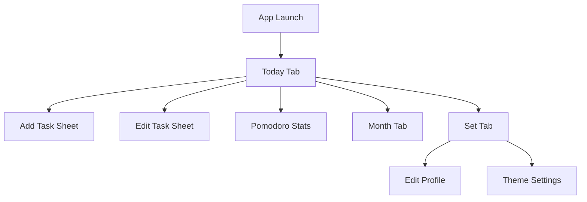

# iOS Todo App 简洁版技术方案

## 1. 文档信息

- 项目名称：`JellyTodo`
- 文档名称：iOS Todo App 简洁版技术方案
- 适用平台：iOS 16+
- 目标版本：MVP 1.0
- 产品定位：超轻量本地 Todo 应用，强调纯白灰黑、超大字号、大卡片、果冻感拟态
- 核心目标：快速上线，优先保证 Today 页体验、极低学习成本、流畅稳定

### 1.1 文档治理规则

- 本文档是 `JellyTodo` 的唯一产品与技术真相源
- 后续若调整功能范围、页面结构、数据模型、主题规则、交互规则，必须先更新本文档，再修改代码
- 仅影响内部实现细节、且不改变外部行为时，可只修改代码
- 每次里程碑交付前，需检查本文档与当前实现是否一致

## 2. 本次补充后的产品范围

### 2.1 一级信息架构

底部 Tab 固定为 3 个：

| Tab | 名称 | 说明 |
| --- | --- | --- |
| Month | 月度待办 | 展示当月全部任务，按日期分组 |
| Today | 今日待办 | 默认首页，展示今日任务和新增入口 |
| Set | 设置 | 展示个人账户设置、主题设置、应用偏好等 |

### 2.2 新增二级页面

- Today 页右上角新增一个小型饼状图 icon
- 点击后进入二级页：`Pomodoro Stats`
- 页面职责：展示番茄钟统计饼状图、专注时长、完成番茄数量、休息占比等

### 2.3 MVP 功能范围

- Todo 任务新增、编辑、删除、完成切换
- Month / Today / Set 三个一级页面
- Today 页顶部番茄钟统计入口
- 完整番茄钟计时能力（Focus / Short Break / Long Break）
- 本地任务持久化
- 本地设置持久化
- 本地番茄钟统计持久化

### 2.4 非 MVP 范围

- 账号登录/注册
- 云同步
- 多端同步
- 任务标签、优先级、复杂筛选
- 深色模式大改版
- 社交、协作、分享

说明：
`Set` 页中的“个人账户设置”在 MVP 内定义为本地个人资料设置，不接真实账号系统，不接服务端。

## 3. 设计原则

### 3.1 视觉基调

- 背景纯白：`#FFFFFF`
- 卡片浅灰：`#F5F5F7`
- 主文字深灰：`#333333`
- 辅助文字浅灰：`#888888`
- 全局禁用彩色强调
- 仅使用黑白透明阴影和高光制造果冻感

### 3.2 版式原则

- 大标题、大卡片、大留白
- 页面结构尽量少层级
- 单屏信息密度低，优先“看起来舒服”
- 默认交互路径最短，减少确认弹窗和多余说明

### 3.3 动效原则

- 点按缩放：`0.98`
- 弹窗自底部弹出
- 列表增删改采用轻量淡入淡出或原生过渡
- Tab 切换无额外炫技动画

## 4. 技术选型

## 4.1 技术栈

- UI：SwiftUI
- 架构：MVVM + 单向数据流
- 路由：`NavigationStack`
- 本地存储：`UserDefaults` + `Codable`
- 状态管理：`ObservableObject` / `@Published`
- 动画：SwiftUI 原生动画
- 日期处理：`Calendar` + `DateFormatter`

### 4.2 选型原因

- SwiftUI 适合快速构建大圆角、大留白、拟态卡片视觉
- `UserDefaults` 足够承载 MVP 的本地轻量数据
- `Codable` 可让 Todo、设置、番茄钟统计统一序列化
- `NavigationStack` 足够支撑 Today 到 Pomodoro Stats 的二级跳转

### 4.3 兼容性策略

- 最低兼容 iOS 16
- 不依赖 iOS 17+ 独占的扇形图快捷 API
- 番茄钟饼状图采用自定义 `Shape` 或 `Canvas` 绘制，以保证 iOS 16 可用

## 5. 核心模块拆分

```text
App
├── Core
│   ├── Models
│   ├── Store
│   ├── Storage
│   ├── Theme
│   └── Utils
├── Features
│   ├── Today
│   ├── Month
│   ├── Set
│   └── PomodoroStats
├── Shared
│   ├── Components
│   ├── Modifiers
│   └── Extensions
└── Resources
```

### 5.1 模块职责

- `Core/Models`：定义 Todo、设置、番茄记录等数据模型
- `Core/Store`：统一承接业务状态和页面数据分发
- `Core/Storage`：封装 `UserDefaults` 读写
- `Core/Theme`：统一颜色、字号、阴影、圆角、间距 Token
- `Features/Today`：Today 页面、新增/编辑弹窗、任务详情二级页
- `Features/Month`：月视图分组列表
- `Features/Set`：设置页与子设置项
- `Features/PomodoroStats`：番茄钟统计图页面
- `Shared/Components`：任务卡片、胶囊按钮、弹窗、分组标题等复用组件

## 6. 数据模型设计

### 6.1 TodoItem

```swift
struct TodoItem: Identifiable, Codable, Equatable {
    let id: UUID
    var title: String
    var isCompleted: Bool
    let createdAt: Date
    var updatedAt: Date
    var taskDate: Date
    var cycle: TodoTaskCycle
    var dailyDurationMinutes: Int
    var note: String
}
```

字段说明：

- `id`：唯一标识
- `title`：任务标题
- `isCompleted`：完成状态
- `createdAt`：创建时间
- `updatedAt`：最近修改时间
- `taskDate`：任务归属日期，用于 Today 筛选和 Month 分组
- `cycle`：任务周期，用于详情页展示与后续计划扩展
- `dailyDurationMinutes`：每天计划投入时长，单位分钟
- `note`：任务正文/备注内容

兼容要求：

- 新增字段必须有默认值，读取旧版本 `UserDefaults` 数据时不能闪退
- 默认周期为 `Daily`，默认每天时长为 `25` 分钟，默认正文为空

### 6.2 PomodoroSession

```swift
enum PomodoroSessionType: String, Codable {
    case focus
    case shortBreak
    case longBreak
}

struct PomodoroSession: Identifiable, Codable, Equatable {
    let id: UUID
    let type: PomodoroSessionType
    let startAt: Date
    let endAt: Date
    let durationSeconds: Int
    let relatedTodoID: UUID?
}
```

说明：

- 本模型用于番茄钟统计页的数据来源
- MVP 以“统计展示”为主，默认基于本地累计记录计算
- 若后续加入完整番茄计时器，可直接复用该模型

### 6.3 UserProfile

```swift
struct UserProfile: Codable, Equatable {
    var nickname: String
    var signature: String
    var dailyGoal: Int
}
```

说明：

- 属于本地“个人账户设置”
- 不涉及服务端账户体系
- 默认值可为空昵称、空签名、每日目标 4 个番茄钟

### 6.4 AppThemeMode

```swift
enum AppThemeMode: String, Codable, CaseIterable {
    case pink
    case blackWhite
    case blue
    case green
}
```

说明：

- Set 页支持四种基调：`Pink / Black White / Blue / Green`
- `Black White` 为当前默认黑白灰视觉，历史 `pureWhite` 本地值兼容映射为 `Black White`
- 主题色只作为轻量强调色使用，不破坏大面积纯白、浅灰、深灰的基础视觉
- 右滑完成填充必须使用当前主题色

### 6.5 AppSettings

```swift
struct AppSettings: Codable, Equatable {
    var themeMode: AppThemeMode
    var hapticsEnabled: Bool
    var pomodoroGoalPerDay: Int
    var useLargeText: Bool
}
```

## 7. 本地存储方案

### 7.1 存储 Key 规划

| Key | 内容 |
| --- | --- |
| `todo.items` | 任务数组 |
| `pomodoro.sessions` | 番茄钟会话数组 |
| `user.profile` | 用户资料 |
| `app.settings` | 设置项 |

### 7.2 存储策略

- 所有模型均通过 `Codable` 转为 JSON Data 写入 `UserDefaults`
- 首次启动若无数据，写入默认设置并返回空任务列表
- 每次新增、编辑、删除、状态切换后立即落盘
- 设置项修改后立即落盘
- 番茄钟统计记录更新后立即落盘

### 7.3 容错策略

- 解析失败时回退为安全默认值
- 单个数据块损坏不影响其他模块读取
- 读取失败不闪退，页面回退为空状态

## 8. 状态管理方案

### 8.1 AppStore 设计

建议建立一个全局 `AppStore`：

```swift
final class AppStore: ObservableObject {
    @Published var todos: [TodoItem] = []
    @Published var pomodoroSessions: [PomodoroSession] = []
    @Published var profile: UserProfile = .init(nickname: "", signature: "", dailyGoal: 4)
    @Published var settings: AppSettings = .init(themeMode: .blackWhite, hapticsEnabled: true, pomodoroGoalPerDay: 4, useLargeText: true)
}
```

### 8.2 业务职责

- 统一加载初始数据
- 统一暴露 Today 列表、Month 分组、番茄统计、设置状态
- 统一暴露任务详情更新能力，页面不得直接写入 `UserDefaults`
- 统一触发保存逻辑
- 避免多个页面各自直接操作 `UserDefaults`

## 9. 页面技术方案

### 9.1 Today 页面

#### 顶部区域

- 左侧：页面标题 `Today`
- 右侧：小型饼状图 icon
- icon 尺寸建议：`22pt x 22pt`
- 点击 icon 使用 `NavigationLink` 进入 `PomodoroStatsView`

#### 列表区域

- 展示 `taskDate` 属于今天的任务
- 列表按 `createdAt` 升序排序
- 单个 Item 高度 `100pt`
- 左右边距 `16pt`
- 卡片间距 `20pt`
- 轻点 Item：进入任务详情二级页
- 长按 Item：完成/取消完成当前任务
- 左滑 Item：显示删除能力，保留编辑能力作为辅助入口

#### 新增入口

- 右下角悬浮胶囊按钮
- 高度 `60pt`
- 最小宽度建议 `112pt`
- 文案：`New Task`

#### 左滑操作

- `Edit`
- `Delete`

技术实现建议：

- 任务列表使用 iOS 原生 `List`
- 单行横向交互以竖向滚动稳定为最高优先级：不再使用横向 `ScrollView` 包裹整行，避免右滑注水被系统横向回弹动效抢占
- 默认停在任务卡片位置；向左滑时卡片自身左移，露出右侧自定义果冻胶囊 `Edit / Delete`
- 向右滑不得拉出新的胶囊或独立区域；主题色必须在原 Item 内从左向右逐步注满，滑到 50% 就停留 50%，达到完成阈值后等效完成当前任务
- `List` 必须隐藏系统分割线和默认背景，通过透明 row background 保留 Jelly 卡片视觉
- 左滑展开后的 UI 必须保持自定义果冻胶囊按钮，不使用系统默认矩形 `swipeActions` 外观

### 9.1.1 任务详情二级页

入口：

- Today 页任务 Item 轻点进入
- 页面使用 `NavigationLink` / `NavigationStack` 原生导航

核心展示与编辑：

- 顶部展示任务标题与完成状态
- `Task Cycle`：任务周期，支持 `Once / Daily / Weekly / Monthly`
- `Daily Duration`：每天计划时长，按 5 分钟步进，范围 `5-480` 分钟
- `Body`：正文区域，支持多行输入，纯白/浅灰卡片，32pt 圆角
- 所有字段变更后通过 `AppStore.updateTodoDetail` 持久化

底部操作：

- 固定底部胶囊按钮：`Enter Pomodoro`
- 点击后进入 `PomodoroStatsView`
- 若当前没有正在运行/暂停的计时器，可携带当前任务 ID 作为 `relatedTodoID`，便于后续番茄记录与任务关联

交互约束：

- 详情页不引入彩色状态
- 输入控件保持灰白黑视觉，不使用系统蓝色强调
- 正文为空时展示浅灰提示语，不影响保存

### 9.2 Month 页面

- 展示当月全部任务
- 使用 `Dictionary(grouping:by:)` 或按自然日分组
- 分组标题格式：`Apr 16`
- 每组标题 24pt 粗体
- 卡片样式与 Today 完全一致

技术要点：

- 使用 `Calendar.current.isDate(_:equalTo:toGranularity:)` 分组
- 为保证排序稳定，先按日期升序，再按创建时间升序

### 9.3 Set 页面

Set 页为新的第三个一级 Tab，结构建议如下：

1. Profile Card
2. Theme Section
3. App Preferences Section
4. About Section

#### Profile Card

- 展示头像占位圆形块
- 昵称
- 个性签名
- 每日目标番茄数

MVP 行为：

- 点击进入本地资料编辑页
- 仅修改昵称、签名、每日目标

#### Theme Section

- 主题模式：Pink / Black White / Blue / Green
- 字体模式：默认大字开启，可切换

#### App Preferences

- 震动反馈开关
- 默认番茄目标

#### About Section

- App 版本
- 设计理念说明

### 9.4 Pomodoro Stats 页面

这是 Today 页 icon 进入的二级页面。

#### 页面内容

- 页面顶部主卡集成番茄钟计时器，不新增独立一级页面
- 顶部标题：`Pomodoro Stats`
- 中央大尺寸饼状图
- 下方数字统计
- 底部时间维度切换：Today / Week / Month

#### 计时器规则

- Focus：25 分钟
- Short Break：5 分钟
- Long Break：15 分钟
- 每完成 4 个 Focus 后，下一个休息自动切换为 Long Break
- 计时器支持开始、暂停、继续、丢弃
- 正常完成后写入 `PomodoroSession`
- 丢弃不会写入统计数据

#### 建议统计项

| 项目 | 说明 |
| --- | --- |
| Focus Time | 专注总时长 |
| Break Time | 休息总时长 |
| Completed Pomodoros | 完成番茄数 |
| Goal Rate | 今日目标达成率 |

#### 饼状图数据分层

- 专注时长
- 短休息时长
- 长休息时长

由于当前视觉系统禁止彩色，建议通过以下方式区分扇区：

- 深灰实色
- 中灰实色
- 浅灰实色
- 配合不同透明度和细描边区分

#### 空状态

- 图表区域显示浅灰空环
- 中心文案：`No pomodoro data`
- 下方引导文案：`Complete a focus session to see stats`

## 10. UI 组件设计

### 10.1 Design Tokens

#### 颜色

| Token | 值 |
| --- | --- |
| `bg.primary` | `#FFFFFF` |
| `bg.card` | `#F5F5F7` |
| `text.primary` | `#333333` |
| `text.secondary` | `#888888` |
| `line.subtle` | `#E9E9EC` |

#### 字号

| 场景 | 字号 |
| --- | --- |
| 页面主标题 | 40pt Bold |
| 页面副标题 / 大统计数值 | 32pt Bold |
| 任务标题 | 28pt Bold |
| 分组标题 / 设置项标题 | 24pt Bold |
| Tab 文案 | 20pt Bold |
| 辅助文字 | 20pt-24pt Bold |

#### 尺寸

| Token | 数值 |
| --- | --- |
| 页面水平边距 | 16pt |
| 大区块间距 | 24pt |
| 卡片间距 | 20pt |
| 卡片高度 | 100pt |
| 输入框高度 | 60pt |
| 按钮高度 | 60pt |
| 统一圆角 | 32pt |

#### 阴影

```swift
shadow(color: .white.opacity(0.8), radius: 4, x: -2, y: -2)
shadow(color: .black.opacity(0.1), radius: 6, x: 2, y: 2)
```

Todo Item 使用更轻的列表阴影，阴影主要向下扩散，避免四个圆角出现明显黑边：

```swift
shadow(color: .white.opacity(0.55), radius: 1, x: 0, y: -1)
shadow(color: .black.opacity(0.045), radius: 9, x: 0, y: 4)
```

### 10.2 任务卡片组件

结构：

- 左侧序号
- 中部标题
- 右侧完成状态圆形勾选区

状态：

- 默认
- 按下态
- 已完成
- 左滑展开态

视觉要求：

- 背景浅灰
- 32pt 大圆角
- 双层阴影
- 标题单行截断
- 已完成时增加删除线，透明度略降

### 10.3 胶囊按钮组件

适用范围：

- 新增任务
- 弹窗确认 / 取消
- 设置页动作按钮

视觉要求：

- 高度 60pt
- 内边距水平 24pt
- 32pt 圆角
- 浅灰背景
- 深灰粗体文字

### 10.4 弹窗组件

适用范围：

- 新增任务
- 编辑任务
- 资料编辑

样式：

- 底部弹出
- 白色卡片
- 32pt 圆角
- 半透明遮罩
- 输入框和按钮均采用胶囊风格

## 11. 完整 UI 设计说明

### 11.1 页面流转



### 11.2 Today 页面 UI

```text
┌────────────────────────────────────┐
│ Today                        ◔     │
│                                    │
│ 01  Buy groceries            ○     │
│                                    │
│ 02  Finish UI draft          ●     │
│                                    │
│ 03  Call mom                 ○     │
│                                    │
│                            New Task│
└────────────────────────────────────┘
```

UI 说明：

- 顶部保留 iOS 大标题空间
- 右上角 icon 较小，不抢主标题视觉
- 列表卡片占据主要视觉面积
- 悬浮按钮固定右下角，避免遮挡最后一个 Item

### 11.3 Month 页面 UI

```text
┌────────────────────────────────────┐
│ Month                              │
│                                    │
│ Apr 16                             │
│ 01  Buy groceries            ○     │
│ 02  Finish UI draft          ●     │
│                                    │
│ Apr 17                             │
│ 01  Review proposal          ○     │
└────────────────────────────────────┘
```

UI 说明：

- 日期标题与任务卡片保持明显层级
- 分组间距大于组内间距
- 日期标题左对齐，强化月历感

### 11.4 Set 页面 UI

```text
┌────────────────────────────────────┐
│ Set                                │
│                                    │
│ [ Avatar ]  Zhang                  │
│            Focus on less, do more  │
│            Daily Goal 4            │
│                                    │
│ Theme                              │
│ Pure White                    >    │
│ Large Text                    On   │
│                                    │
│ Preferences                        │
│ Haptics                       On   │
│ Pomodoro Goal                 4    │
│                                    │
│ About                              │
│ Version                        1.0 │
└────────────────────────────────────┘
```

UI 说明：

- 顶部个人资料卡片更大更柔和，延续果冻感
- 设置项为整行大按钮，方便点按
- 页面仍然维持纯灰白体系

### 11.5 Pomodoro Stats 页面 UI

```text
┌────────────────────────────────────┐
│ Pomodoro Stats                     │
│                                    │
│             ◜██████◝               │
│           ██  68%   ██             │
│             ◟████◞                 │
│                                    │
│ Focus Time           125 min       │
│ Break Time            35 min       │
│ Completed                5         │
│                                    │
│        Today   Week   Month        │
└────────────────────────────────────┘
```

UI 说明：

- 饼图居中，占据页面核心焦点
- 中心可显示百分比或番茄数
- 下方数据卡使用大字号统计展示
- 时间粒度切换使用胶囊分段控件风格

### 11.6 新增 / 编辑任务弹窗 UI

```text
┌────────────────────────────────────┐
│                                    │
│            New Task                │
│                                    │
│  [ Enter task title             ]  │
│                                    │
│   Cancel               Confirm     │
│                                    │
└────────────────────────────────────┘
```

UI 说明：

- 标题、输入框、按钮都保持超大尺寸
- 避免信息拥挤
- 键盘弹出时弹窗整体上移

## 12. 关键实现细节

### 12.1 果冻感实现

统一封装 `JellyCardModifier`，并按场景区分 `standard` 与 `listItem` 阴影：

```swift
struct JellyCardModifier: ViewModifier {
    let shadowStyle: JellyShadowStyle

    func body(content: Content) -> some View {
        content
            .background(ThemeTokens.card(for: themeMode))
            .clipShape(RoundedRectangle(cornerRadius: 32, style: .continuous))
    }
}
```

### 12.2 大字号适配

- 全局使用统一 Typography Token
- 保证 28pt 任务标题在小屏设备上仍为单行可截断
- 设置页和统计页允许两行辅助说明，任务卡片不允许两行

### 12.3 番茄钟统计图实现

由于最低版本为 iOS 16，推荐方案：

1. 使用自定义 `DonutChartView`
2. 输入各分段时长占比
3. 用 `Path` 绘制圆弧段
4. 中心区域展示百分比或专注分钟数

优点：

- 无需额外三方库
- 兼容 iOS 16
- 视觉风格可完全受控

## 13. 开发排期建议

### Phase 1

- 搭建 SwiftUI 工程骨架
- 建立 Theme Token / Model / Storage / AppStore
- 完成 Today 页基础列表

### Phase 2

- 完成新增、编辑、删除、完成切换
- 接入 UserDefaults 持久化
- 打磨果冻卡片与大字号组件

### Phase 3

- 完成 Month 页和 Set 页
- 接入个人资料、本地设置

### Phase 4

- 完成 Pomodoro Stats 二级页
- 完成自绘饼图
- 完成统计聚合逻辑

### Phase 5

- 动效优化
- 异常状态检查
- 真机适配和验收

## 14. 测试方案

### 14.1 功能测试

- 新增任务成功并持久化
- 编辑任务成功并刷新
- 删除任务成功并重新排序
- 完成状态切换正常
- Month 分组正确
- Set 页设置修改后重启仍生效
- Pomodoro Stats 页面可正确展示空状态和统计状态

### 14.2 UI 测试

- iPhone 13 mini / 15 / 15 Pro Max 尺寸验证
- 大字号下卡片不溢出
- 弹窗与键盘不重叠
- 左滑按钮不破坏整体圆角视觉

### 14.3 性能测试

- 500 条任务列表滚动流畅
- 1000 条本地番茄记录统计聚合在可接受范围内
- 冷启动时间控制在 2 秒内

## 15. 验收标准补充

### 15.1 新增验收项

- Today 页右上角存在饼状图 icon 且点击可进入二级页
- Pomodoro Stats 页面可展示饼图、关键统计数据、时间维度切换
- 第三个 Tab 已从 `Total` 更换为 `Set`
- Set 页至少包含个人资料、主题设置、应用偏好、关于四个区块

### 15.2 视觉验收补充

- 番茄钟统计页依旧遵循纯灰白体系
- Set 页不能出现彩色开关风格污染整体视觉
- 图标、文字、卡片尺寸统一，保持“大字体、大 Item、低密度”

## 16. 结论

该方案在不引入服务端的前提下，已经覆盖：

- 完整的 Todo MVP
- 新增的番茄钟统计二级页
- 新的 Set 设置页
- 本地资料和主题管理
- 可直接指导 iOS 端使用 SwiftUI 进行落地开发

若进入下一步执行，建议先从 `Today + Storage + Jelly UI Token` 三个基础模块开工，再接 Month、Set 与 Pomodoro Stats。
